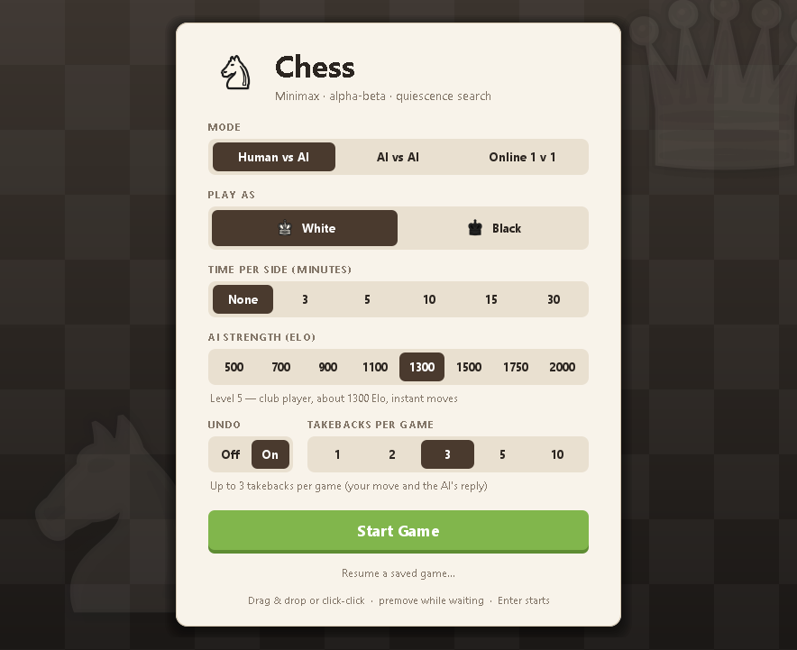
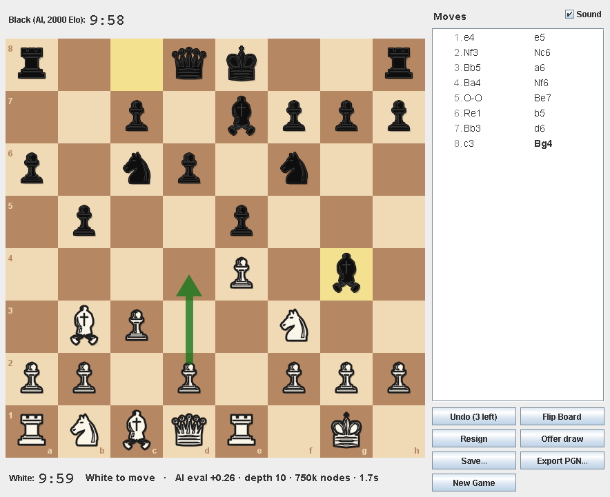
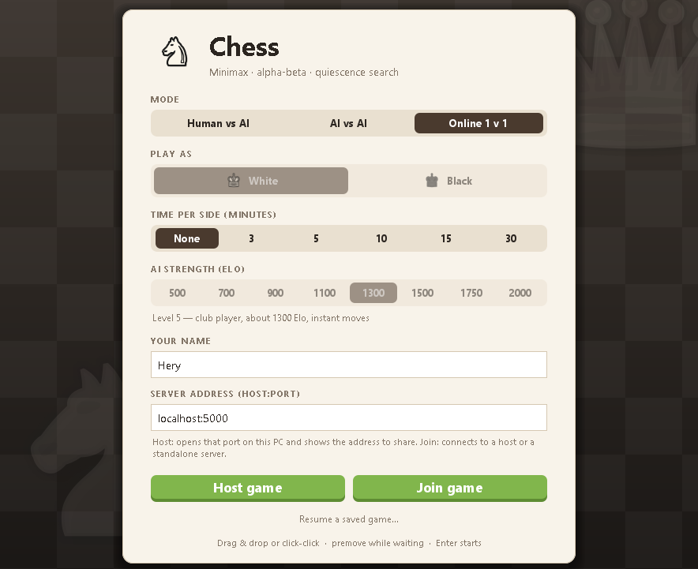
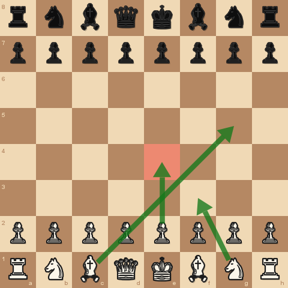
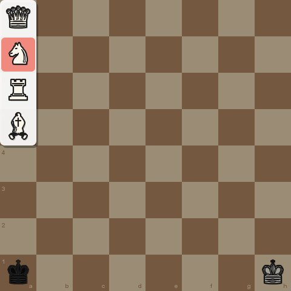

# Chess — Java Swing, Minimax/Alpha-Beta AI

A complete chess game: Human vs AI, AI vs AI and online 1 v 1 over Java
sockets, full FIDE move rules, optional
chess clocks (or an untimed game), and a negamax (minimax + alpha-beta) engine
with iterative deepening, transposition table, quiescence search and a small
opening book. Java 21, zero external dependencies.

## Screenshots

<p align="center">
  
  
</p>
<p align="center">
  
  
  
</p>

## Playing

- **Move by click-click or drag & drop.** Click a piece (legal destinations
  are marked) then click a destination, or press on a piece and drag it onto
  its destination. Dropping a piece back on its own square keeps it selected;
  dropping it anywhere illegal snaps it back.
- **Premoves (chess.com style).** While the AI is thinking you can already
  enter your reply: pick one of your pieces and choose any square it could
  reach on an empty board (blockers are ignored — the position will change).
  Premoves are highlighted in red, the pieces are painted where they will
  stand, and the queue is echoed in the status line. Several can be queued:
  each later one is entered on the board as it will look after the earlier
  ones. As soon as it is your turn the first premove is played if it is
  legal in the new position (promotions default to a queen); if it is not,
  the whole queue is dropped. While waiting, clicking anything that is not
  an own piece or a destination clears the queue; right-click clears it too.
- **Right-click** highlights a square, **right-drag** draws an arrow (again
  to remove); any left-click or move clears them.
- **Promotion** opens a strip of four pieces on the board starting at the
  promotion square; click one to promote, click anywhere else to cancel.
- **Undo** (Ctrl+Z, Human vs AI): takes back your last move and the AI's
  reply — also while the AI is thinking, or after the game has ended. The
  start screen decides whether takebacks exist at all (Undo Off / On) and,
  when on, how many the game allows (1, 2, 3, 5 or 10 — 3 by default). The
  button shows what is left ("Undo (2 left)") and greys out once the
  allowance is spent; the count is kept in saved games.
- **Move list** in standard algebraic notation beside the board, and
  **Export PGN…** to save the game (seven-tag roster + move text).
- **Sounds** for move, capture, check and game end — synthesised at
  start-up (no audio files), switchable with the Sound checkbox, silent
  when no audio device exists.
- **Save… / Resume a saved game…** write and reload a small text file
  (`.chess`: settings, clocks, takebacks spent, moves in long algebraic
  notation, replayed and validated on load).
- **Resign** and **Offer draw** (Human vs AI): the AI accepts a draw when
  its last search rated its own position no better than about +0.30 and
  the game has left the opening; otherwise the offer is declined.
- **Game over** dialog offers a rematch (colours swapped), a new game, or
  staying on the final position to review it.
- Window placement, the sound switch and the last start-screen settings
  are remembered between runs (`java.util.prefs`).
- **Flip Board** rotates the view; **New Game** returns to the start screen.
- **AI strength** is chosen as an Elo figure, 500 to 2000 in eight levels —
  see [AI levels](#ai-levels-approximate-elo).

## AI levels (approximate Elo)

The start screen picks the AI strength as an Elo figure. Each level is a
search depth plus, for the weaker ones, *evaluation noise*: every legal
move is scored exactly at that depth, Gaussian noise is added to each
score and the noisy maximum is played. The engine still prefers good moves
but misjudges regularly, and once the noise is comparable to a piece value
it hangs material the way a beginner does — a far more natural weakness
than a shallow-but-exact search, which never blunders a piece and only
loses in the long run. Levels without noise are the full engine at a
depth cap (`engine.Skill`).

| Level | Elo | Depth | Noise (cp) | Book | Plays like | Measured ACPL → Elo |
|---|---|---|---|---|---|---|
| 1 | 500 | 1 | 260 | – | just learning: hangs pieces | 140 cp → ~590 |
| 2 | 700 | 1 | 185 | – | beginner | 122 cp → ~720 |
| 3 | 900 | 2 | 165 | – | casual player | 91 cp → ~1010 |
| 4 | 1100 | 3 | 125 | yes | improving | 77 cp → ~1180 |
| 5 | 1300 | 3 | 110 | yes | club player (default) | 71 cp → ~1270 |
| 6 | 1500 | 4 | 85 | yes | strong club player | 56 cp → ~1500 |
| 7 | 1750 | 7 | 0 | yes | expert | estimate |
| 8 | 2000 | 10 | 0 | yes | maximum strength | estimate |

How the labels were set: head-to-head self-play is useless here (between
two blunder-prone players the one who blunders half as often wins nearly
every game, which reads as 400+ Elo for a fraction of that), so
`test.Calibrate` measures each level the way rating sites judge humans —
its **average centipawn loss per move** (ACPL) over self-play games, every
move judged by the full engine at depth 8 — and converts it with a curve
fitted to published Lichess statistics (about 110 cp at 800, 65 at 1400,
34 at 2000: `Elo ≈ 2000 − 1000·ln(ACPL / 34)`). The noise of levels 1–6
was tuned until the measured figure landed on the label (last column;
±100 is the precision this claims). The judge cannot rate levels 7 and 8
(it is the same engine at a similar depth), so those two are estimates of
where a depth-7 / depth-10 engine of this kind lands against humans.

## Online 1 v 1 (two PCs, Java sockets)

Pick **Online 1 v 1** on the start screen, type a name and a `host:port`.

- **Host game** opens that port on your PC (an embedded server), shows the
  addresses to share, and waits. The other player picks **Join game** with
  your `ip:port`. Only the port matters for the host; the time control is
  the host's (first arrival's).
- **Standalone server** — both players join the same machine, which can be
  a third one: `java -cp chess.jar app.ServerMain 5000`. It pairs clients
  two by two in arrival order, so several games can run at once.
- The server is the referee: it keeps its own game per room and only relays
  a move that is legal and from the side to move. Both clients still
  adjudicate mate / stalemate / draws locally from the identical move list.
- Each side runs its own clock; a player reports their **own** flag fall.
  Resign, draw offers (the opponent decides), premoves and rematch (colours
  swapped, both must accept) work online. A disconnect forfeits the game
  for the player who dropped; losing your own connection aborts it.
- Protocol: one text line per message (`HELLO`, `START`, `MOVE e2e4`,
  `RESIGN`, `DRAW_OFFER/ACCEPT/DECLINE`, `TIMEOUT`, `REMATCH`,
  `OPPONENT_LEFT`, `ERROR`, `PING/PONG`) — see `net/Protocol.java`.
  Player names are reduced to single safe tokens.
- Firewalls: the host must allow inbound TCP on the chosen port; across the
  Internet the host's router needs a port forward. Names travel in clear —
  there is no encryption or authentication (LAN / friends use).

## Build & run

```bash
./build.sh          # Linux / macOS / Git Bash   (Windows PowerShell: .\build.ps1)
java -jar chess.jar                          # the game
java -cp chess.jar app.ServerMain 5000       # optional: standalone online server
```

The scripts compile into `out/` with `-Xlint:all,-serial` and package an
executable `chess.jar` (tests excluded). Without the scripts:

```bash
javac --release 21 -d out $(find src -name "*.java")
java -cp out app.Main
```

## UCI (play it in any chess GUI)

```bash
java -cp chess.jar app.Uci
```

The engine speaks the Universal Chess Interface, so it can be added to
Arena, CuteChess, Banksia or a Lichess bot and matched against other
engines for an absolute Elo figure (`test.Arena` only measures it against
itself). Supported: `uci`, `isready`, `ucinewgame`, `setoption name
Hash|OwnBook`, `position startpos|fen … [moves …]`, `go depth|movetime|
wtime/btime/winc/binc|infinite`, `stop`, `quit`; one `info` line per
completed iteration. With a clock it spends about 1/30 of the remaining
time plus half the increment per move.

## Tests (plain main-class runners — no JUnit, so a bare JDK builds everything)

```bash
./test.sh           # or .\test.ps1 — runs the five runners below, headless
java -cp out test.PerftTest      # engine acceptance gate: 11 standard perft positions
java -cp out test.EngineTests    # 83 targeted rule / draw / search / SEE / notation / session tests
java -cp out test.UiTests        # 66 checks: Swing views driven by synthetic mouse events
java -cp out test.NetTests       # server + two clients over loopback: pairing, relay, rematch, disconnects
java -cp out test.UciTests       # drives app.Uci through a pipe: handshake, searches, stop, book
java -cp out test.Arena [games=40] [movetime=100|depth=4] [a=all] [b=baseline]   # engine vs engine, Elo report (minutes)
java -cp out test.Calibrate [levels=1-6] [games=8] [depth=8]                     # ACPL of each strength level -> Elo (minutes)
```

`UiTests` needs no display: it dispatches `MouseEvent`s straight into
`BoardPanel` (click-click, drag & drop, premoves, flipped geometry, painting)
and clicks through `StartScreen` to check the emitted `GameConfig`.
CI (`.github/workflows/ci.yml`) runs build + all runners on every push.

`PerftTest` exercises the full generation + make/unmake pipeline against
published node counts (12.5M nodes, exact match required). `EngineTests`
covers each castling refusal condition individually, the en-passant
horizontal-pin trap, incremental Zobrist correctness over a random playout,
threefold repetition, the fifty-move rule, every insufficient-material case,
ply-adjusted mate scoring, and timeout adjudication (including the
flag-fall-vs-bare-king draw per FIDE 6.9). Both exit non-zero on failure.

## Architecture

```
engine/   Board, Move, MoveGenerator, Zobrist, Evaluator, Search, TranspositionTable,
          OpeningBook, Perft
          Pure rules + search. Zero dependencies on game/ or ui/. No Swing.
game/     GameSession, ChessClock, GameConfig, GameResult, Notation (SAN / PGN), SavedGame
          Everything above single-position level: history, repetition table,
          draw adjudication, clocks, timeout verdicts. No Swing widgets.
net/      Protocol, ChessServer, ChessClient
          Line-based socket protocol; the server referees with its own
          GameSession per room, the client delivers messages on the EDT.
ui/       MainFrame, StartScreen, OnlineLobbyPanel, GamePanel, BoardPanel,
          PieceRenderer, Sounds, Prefs
          Swing only. Never mutates engine state directly — all moves flow
          through GameSession. MainFrame owns the online connection.
app/      Main (EDT bootstrap), ServerMain (standalone relay server)
test/     PerftTest, EngineTests, UiTests, NetTests
```

### Threading model

The EDT owns all game state (`GameSession`, `ChessClock`). The AI runs in a
`SwingWorker` on a **private `Board.copy()`** — it never touches shared state.
Cancellation is cooperative (an `AtomicBoolean` polled every 2048 nodes);
timeouts and New Game set it and discard the result. A stale-worker guard in
`done()` plus the session's own move-legality validation make a late-finishing
worker harmless. The 100 ms UI timer is a *sampler* only: the clock is
`nanoTime`-anchored, so timer drift cannot corrupt timekeeping.

Online games keep that model intact: `ChessClient` reads the socket on its
own thread but hands every message to the EDT (`invokeLater`, queued until a
listener is installed), so `GamePanel` mutates the session from the EDT
exactly as for a clicked move. `ChessServer` runs one accept thread and one
reader thread per client; a room's state is guarded by the room's monitor and
its referee `GameSession` is created without EDT confinement. When the server
is embedded in the GUI ("Host game") all its threads are daemons, so closing
the window ends it; `ServerMain` uses non-daemon threads and runs until
killed.

## Recorded design trade-offs

| Decision | Rationale | Cost accepted |
|---|---|---|
| Int piece encoding, not enums | Hot-loop indexing, packing into undo records | `colorOf(EMPTY)` is meaningless; callers must check emptiness |
| `Move` as a record, not packed int | Debuggability, free value equality (UI + tests rely on it) | Allocation per generated move — tolerable at this node budget |
| Pseudo-legal gen + make/unmake filter | Provably correct via perft; simplest scheme to verify | ~2x slower than a legal generator with pin detection |
| Negamax formulation | One code path, half the sign-bug surface; algebraically identical to min/max | Requires symmetric (side-relative) evaluation |
| Quiescence with in-check evasions | Kills the horizon effect; never stands pat while mated | Extra nodes at the horizon |
| Ordering: TT move, promotions, MVV-LVA captures, killers, history — no checks-first | Checks-first ordering costs more than it prunes at these depths; the check extension covers the tactical need | Slightly worse cutoff rate in check-heavy positions |
| Tapered king MG/EG tables | A hard phase switch causes eval discontinuities and move flip-flop | A few extra multiplies per eval |
| No mobility term | Requires movegen inside the hottest function; poor value at this depth | Weaker positional play |
| All draws auto-declared | No claim UI; unambiguous verdicts | Diverges from OTB claim rules (accepted spec) |
| Unicode glyph rendering behind `PieceRenderer` | No binary assets in a source deliverable; font scan + letter fallback | Glyph aesthetics vary by platform; image renderer is a drop-in later |
| Premoves = queue of (from, to) pairs, each resolved against the legal list when its turn arrives | Never submits an illegal move; no engine changes; a stale premove drops the queue | Later premoves are entered on a naively projected board (no legality); auto-queen on promotion; played by a one-shot timer after the AI move's slide |
| Move animation paints the post-move board with the moving piece interpolated | No intermediate game state, nothing to roll back; a takeback mid-slide just draws the restored board | Captured piece vanishes at the start of the slide rather than on arrival |
| Online: the server referees with its own `GameSession` and relays only legal, in-turn moves | Two honest clients can never diverge; a tampered client cannot cheat with nonsense; the engine's rules are reused unchanged | One extra move generation per move on the server; a desync (should never happen) aborts the game rather than guessing |
| Online: each side runs its own clock and reports its *own* flag fall | No clock authority or latency protocol needed; an honest client cannot gain by lying about itself | Network latency is not compensated; a silent opponent is only dropped by the 30 s idle timeout |
| Online: one plain-text line per message, names reduced to safe tokens | Debuggable with `telnet`/`nc`, trivial to parse, no framing bugs | No encryption or authentication — LAN / friends use only |
| Online: colours by order of HELLO processing, time control from the first arrival | No negotiation round-trip; both clients simply obey `START` | The host cannot choose a colour; a joiner's time setting is ignored |
| Drag state lives in `BoardPanel` alongside click selection | One `(from, targets)` model serves click-click, drag and premove; a drop is just a click on the target | Board is repainted on every drag event (fine at 8x8 with a single glyph) |
| Full prior Zobrist hash stored in `Undo` | Unconditional unmake correctness for 8 bytes/ply | None meaningful |
| Selective search (null move, LMR, futility, SEE) instead of exhaustive alpha-beta | Several times fewer nodes per depth, so 2–3 plies deeper at equal time; every technique measured by `test.Arena` and switchable for re-measurement | Rare misses (zugzwang, quiet sacrifices); more code paths in the hottest function |
| Mobility in the evaluation | Neutral at 100 ms/move, +89 Elo at 300 ms: the knowledge pays off as the search deepens | Slower evaluation, fewer nodes per second |

### Search (v2)

- **Iterative deepening with a time budget.** The "AI strength" setting is
  the maximum depth; with a clock the engine spends about 1/30 of its
  remaining time per move (100 ms – 8 s) and returns the last completed
  iteration when the budget runs out, so it no longer loses on time.
  Untimed games search to the fixed depth with a 15 s safety cap.
- **Transposition table** (1M entries, Zobrist-keyed, age-aware
  replacement) — exact/bound cutoffs plus the previous iteration's best move
  first. One `Search` (and table) lives for the whole game; `findBest` is
  synchronized and works on a private board copy.
- **Repetition detection in the tree.** The game's position keys plus the
  search path form one key stack; a position seen before scores as a draw.
  A winning engine no longer drifts into threefold, a lost one seeks the
  perpetual (both covered by tests).
- Check extension, killer moves, history heuristic, principal variation
  reported to the UI (eval, depth, nodes, time in the status line).
- **Opening book** (`OpeningBook`): ~30 mainstream lines expanded into a
  Zobrist-keyed map at class load (every entry verified legal), probed
  before searching; a random book move gives opening variety at zero cost.

### Search (v3): selectivity, measured

Plain alpha-beta looks at every move to the same depth. v3 keeps that for
the principal variation and spends less everywhere else, which is what
lets it search two to three plies deeper in the same time. Each technique
lives behind a switch in `Search.Options`, and **`test.Arena`** — an
engine-vs-engine harness that plays feature sets against each other from
the book openings (each opening twice, colours swapped) and reports the
result as an Elo difference with a 95% interval — is how every one of
them earned its place. Measured on a 6-core desktop at 100 ms per move
(40 games unless noted; brackets are the 95% interval):

| Match | Score | Elo |
|---|---|---|
| v3 vs v2 (plain alpha-beta, material + PST) | +33 =5 −2 (88.8%) | **+359** [+248, +596] |
| v3 vs v3 without PVS and LMR | +25 =10 −5 (75.0%) | +191 [+100, +315] |
| v3 vs v3 without futility pruning | 60.0% | +70 [−27, +181] |
| v3 vs v3 without aspiration windows | 58.8% | +61 [−29, +161] |
| v3 vs v3 without pawn structure / bishop pair / rooks | 56.3% | +44 [−54, +149] |
| v3 vs v3 without null-move pruning (80 games) | 51.9% | +13 [−52, +79] |
| v3 vs v3 without mobility (80 games) | 51.2% | +9 [−57, +75] |
| v3 vs v3 without mobility, at 300 ms per move | 62.5% | +89 [−6, +198] |
| v3 vs v3 without SEE in quiescence (60 games) | 51.7% | +12 [−61, +85] |
| v3 vs v3 with Michniewski tables instead of PeSTO (80 games) | 59.4% | +66 [−4, +142] |

The combined gain is unambiguous. A single technique is worth tens of Elo,
which 40–80 games cannot separate from noise, so the rows below the first
show a sign and an interval, not a verdict. One idea was measured and
dropped: demoting SEE-losing captures below the quiet moves in the move
ordering (−17 [−96, +59] over 60 games — the exchange scan at every node
cost more than the ordering saved). At fixed depth the picture is simpler:
v3 reaches depth 10 in 0.4–2.8 s on typical middlegames, where v2 needed
8 s for depth 7.

- **Principal variation search.** After the first move of a node the rest
  are searched with a null window (alpha, alpha + 1): a cheap proof that
  they are not better. Only a move that fails that proof is re-searched
  with the full window.
- **Null-move pruning.** If passing the turn at reduced depth (R = 2, 3
  from depth 6) still scores above beta, the node is cut. Never in check,
  never near mate scores, never without non-pawn material (zugzwang).
- **Late move reductions.** Quiet moves late in the order are searched at
  reduced depth (log formula in depth and move number); any that beats
  alpha gets its full-depth search back.
- **Futility pruning** at depth 1–2 skips quiet, non-checking moves when
  the static evaluation plus a margin cannot reach alpha; **reverse
  futility** returns early from a node whose evaluation beats beta by a
  depth-scaled margin.
- **Aspiration windows.** From depth 4 each iteration starts ±30 cp around
  the previous score and widens on failure, so most iterations search a
  much narrower tree.
- **Static exchange evaluation** (`StaticExchange`, with x-ray attackers):
  captures that lose material are not tried in quiescence; **delta
  pruning** drops captures that cannot bring the score back to alpha.
  Mate-distance pruning and a history malus for quiet moves that failed to
  cut complete the picture.
- **Evaluation** uses PeSTO's material values and piece-square tables
  (Ronald Friederich's public-domain, Texel-tuned set, +66 Elo over the
  Michniewski tables of v2), is fully tapered (every term has a middlegame
  and an endgame value blended by remaining material) and knows about passed,
  isolated and doubled pawns, the bishop pair, rooks on open / half-open
  files and the seventh rank, and piece mobility (squares not covered by
  enemy pawns). Mobility was left out of v2 as too costly for the hottest
  function; the arena shows it paying off as the time per move grows.

## Known limitations

1. **En-passant file is hashed whenever set**, even if no ep capture is
   actually legal — repetition detection is conservative (may detect one
   occurrence late; never declares falsely).
2. **Search is single-threaded** by design (correctness first).
3. **The search is selective**: null-move pruning, reductions and futility
   margins can overlook a deep zugzwang or a quiet sacrifice that plain
   alpha-beta at the same depth would see. Accepted because the depth they
   buy wins far more games than those misses lose — that is what
   `test.Arena` is for, and every technique can be switched off there.
4. **Online play is unencrypted and unauthenticated**; clocks are not
   latency-compensated; there is no takeback, chat or reconnection to a
   game in progress (a dropped connection forfeits or aborts the game).
